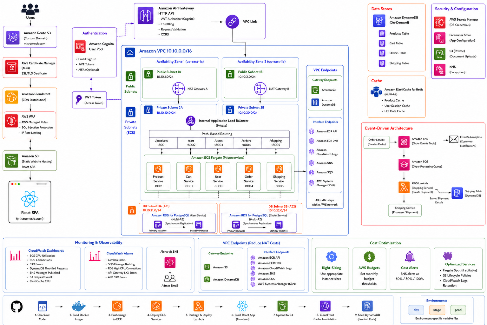

# MicroMesh — Production-Grade E-Commerce Platform on AWS


> **22 Terraform Modules · 5 Microservices · 25+ AWS Services · Event-Driven Architecture · Multi-Environment CI/CD**

MicroMesh is a fully production-grade e-commerce platform built with a microservices architecture on AWS. It features 5 FastAPI microservices running on ECS Fargate, event-driven order processing with SNS/SQS/Lambda, Redis caching, WAF security, and complete Infrastructure as Code with 22 Terraform modules supporting `dev`, `stage`, and `prod` environments.

---

## Live Preview

> The React SPA is served via CloudFront from S3, authenticated through Amazon Cognito.


---

## Table of Contents

- [Architecture Overview](#architecture-overview)
- [Project Structure](#project-structure)
- [AWS Services Used](#aws-services-used)
- [Prerequisites](#prerequisites)
- [Quick Start](#quick-start)
- [Detailed Setup Guide](#detailed-setup-guide)
- [Microservices](#microservices)
- [Database Design](#database-design)
- [Event-Driven Architecture](#event-driven-architecture)
- [CI/CD Pipeline](#cicd-pipeline)
- [Monitoring & Observability](#monitoring--observability)
- [Security](#security)
- [Cost Optimization](#cost-optimization)
- [Dev vs Prod Comparison](#dev-vs-prod-comparison)
- [Cleanup](#cleanup)
- [Troubleshooting](#troubleshooting)

---

## Architecture Overview

The diagram below covers the full system: edge layer (Route 53 → CloudFront → WAF), API Gateway with Cognito JWT auth, VPC Link into the private ALB, 5 ECS Fargate microservices, dual-database layer (RDS PostgreSQL + DynamoDB), ElastiCache Redis, event-driven order processing (SNS → SQS → Lambda), VPC Endpoints, monitoring, cost controls, and the 9-step CI/CD deployment pipeline.



---

## Project Structure

```
MicroMesh/
├── frontend/
│   └── react-vite-app/              # React + Vite frontend
│       ├── src/
│       │   ├── components/
│       │   │   ├── cart/            # Cart page
│       │   │   ├── layout/          # Navbar, Footer
│       │   │   ├── orders/          # Order history
│       │   │   └── products/        # Product listing
│       │   ├── api.js               # API service layer
│       │   ├── aws-config.js        # Cognito configuration
│       │   └── CartContext.jsx      # Cart state management
│       └── vite.config.js
│
├── services/
│   ├── product-service/             # FastAPI – Products  (DynamoDB)
│   ├── cart-service/                # FastAPI – Cart      (DynamoDB)
│   ├── user-service/                # FastAPI – Users     (RDS)
│   ├── order-service/               # FastAPI – Orders    (RDS)
│   └── shipping-service/            # FastAPI – Shipping  (DynamoDB)
│
├── lambda/
│   └── order-shipment-processor/    # SQS → Lambda → Shipping
│
├── terraform/
│   ├── global/                      # S3 backend setup
│   ├── modules/                     # 22 Terraform modules
│   │   ├── vpc/                ├── security-groups/   ├── vpc-endpoints/
│   │   ├── secrets-manager/    ├── dynamodb/          ├── rds/
│   │   ├── elasticache/        ├── alb/               ├── ecs/
│   │   ├── iam/                ├── cognito/           ├── api-gateway/
│   │   ├── sns/                ├── sqs/               ├── lambda/
│   │   ├── waf/                ├── frontend/          ├── monitoring/
│   │   ├── ssm/                ├── route53/           └── budget/
│   ├── environments/
│   │   ├── dev/
│   │   ├── stage/
│   │   └── prod/
│   └── scripts/                     # Deployment scripts
│
├── data/
│   ├── product-images/              # 20 sample product images
│   ├── products.json
│   ├── upload-images-to-s3.sh
│   ├── update-product-image-urls.sh
│   └── load-products.sh
│
└── .github/
    └── workflows/
        └── ci-cd.yml                # CI/CD Pipeline
```

---

## AWS Services Used

| Category | Services |
|---|---|
| **Compute** | ECS Fargate, Lambda |
| **Networking** | VPC, Subnets, NAT Gateway, Internet Gateway, VPC Endpoints |
| **Database** | RDS PostgreSQL, DynamoDB, ElastiCache Redis |
| **Storage** | S3, ECR |
| **CDN & DNS** | CloudFront, Route 53 |
| **Security** | WAF, ACM, Cognito, Secrets Manager, IAM, Security Groups |
| **Integration** | API Gateway, SNS, SQS, VPC Link |
| **Monitoring** | CloudWatch (Logs, Metrics, Dashboards, Alarms) |
| **Governance** | Budgets, SSM Parameter Store |
| **CI/CD** | GitHub Actions |

---

## Prerequisites

Before you begin, ensure you have the following:

- AWS Account with admin access
- [AWS CLI](https://aws.amazon.com/cli/) installed and configured (`aws configure`)
- [Terraform](https://www.terraform.io/downloads) >= 1.5.0
- [Docker](https://www.docker.com/) installed and running
- [Node.js](https://nodejs.org/) >= 18
- [Git](https://git-scm.com/)
- A domain name registered in Route 53 (e.g., `cloudforsushant.xyz`)
- ACM Certificate issued in `us-east-1` for your domain

---

## Quick Start

### One-Time Setup

```bash
# 1. Clone the repository
git clone https://github.com/sushantpaudel77/MicroMesh.git
cd MicroMesh

# 2. Initialize Terraform backend (creates S3 bucket for state)
cd terraform
./scripts/init-backend.sh

# 3. Configure GitHub Secrets (for CI/CD):
#    AWS_ACCESS_KEY_ID · AWS_SECRET_ACCESS_KEY · AWS_ACCOUNT_ID
#    AWS_REGION · ADMIN_EMAIL · DOMAIN_NAME · ACM_CERT_ARN
```

### Deploy via GitHub Actions *(Recommended)*

1. Go to **GitHub Actions → CI/CD Pipeline**
2. Click **Run workflow**
3. Select: `Environment: dev` · `Action: deploy-all`
4. Click **Run workflow**
5. Wait ~15 minutes for complete deployment ✅

### Deploy via CLI

```bash
# Development environment
./terraform/scripts/deploy.sh dev

# Production environment
./terraform/scripts/deploy.sh prod
```

---

## Detailed Setup Guide

### 1. Clone & Configure

```bash
git clone https://github.com/sushantpaudel77/MicroMesh.git
cd MicroMesh
```

### 2. Initialize Backend

Creates an S3 bucket to store Terraform state:

```bash
cd terraform/global
terraform init
terraform apply -auto-approve
```

**What this creates:**

- S3 bucket: `ecommerce-terraform-state-cloudnerd`
- Versioning enabled · Encryption enabled · Public access blocked

### 3. Build Docker Images

```bash
cd terraform
./scripts/build-push-single.sh
```

**Services built:**

| Image | Service |
|---|---|
| `ecommerce/product-service` | Product catalog |
| `ecommerce/cart-service` | Shopping cart |
| `ecommerce/user-service` | User management |
| `ecommerce/order-service` | Order processing |
| `ecommerce/shipping-service` | Shipment tracking |

### 4. Deploy Infrastructure

```bash
cd terraform
./scripts/deploy.sh dev
```

<details>
<summary><strong>What this creates (click to expand)</strong></summary>

- VPC with 6 subnets across 2 AZs
- NAT Gateway + Internet Gateway
- 8 VPC Endpoints (S3, DynamoDB, ECR, CloudWatch, SNS, SQS, SSM, Secrets Manager)
- RDS PostgreSQL (`db.t4g.micro`, 20GB)
- ElastiCache Redis (`cache.t3.micro`)
- 3 DynamoDB tables (Products, Cart, Shipping)
- ALB with path-based routing
- 5 ECS Fargate services
- Cognito User Pool
- API Gateway with VPC Link
- SNS Topics + SQS Queue + Lambda
- CloudFront + S3 for frontend
- WAF Web ACL
- CloudWatch Dashboard + 5 Alarms
- SSM Parameter Store (17 parameters)
- Secrets Manager
- Route53 DNS records
- Budget ($10/month)

</details>

### 5. Deploy Frontend

```bash
cd frontend/react-vite-app

# Create .env with your values
cat > .env << EOF
VITE_COGNITO_USER_POOL_ID=<your-pool-id>
VITE_COGNITO_USER_POOL_CLIENT_ID=<your-client-id>
VITE_API_BASE_URL=<your-api-url>
EOF

npm install
npm run build
aws s3 sync dist/ s3://<your-bucket>/ --delete --exclude "images/*"
```

### 6. Seed Product Data

```bash
cd data
bash upload-images-to-s3.sh dev us-east-1
bash update-product-image-urls.sh dev us-east-1
bash load-products.sh dev us-east-1
```

### 7. Verify Deployment

```bash
# Check ECS services
aws ecs describe-services \
  --cluster ecommerce-cluster-dev \
  --services ecommerce-product-svc-dev \
  --region us-east-1 \
  --query 'services[0].runningCount'

# Test API
curl https://<api-id>.execute-api.us-east-1.amazonaws.com/products

# Open frontend
open https://dev.cloudforsushant.xyz
```

---

## Microservices

| Service | Port | Database | Description |
|---|---|---|---|
| **Product Service** | 8001 | DynamoDB | Product catalog, inventory management |
| **Cart Service** | 8002 | DynamoDB | Shopping cart management |
| **User Service** | 8003 | RDS PostgreSQL | User profiles, Cognito integration |
| **Order Service** | 8004 | RDS PostgreSQL | Order creation, SNS publishing |
| **Shipping Service** | 8005 | DynamoDB | 15-state shipment tracking |

### Shipping State Machine

```
PENDING → LABEL_CREATED → PICKUP_SCHEDULED → PICKED_UP → IN_TRANSIT
       → ARRIVED_AT_HUB → OUT_FOR_DELIVERY → DELIVERED
       → DELIVERY_FAILED → RETURN_INITIATED → RETURN_IN_TRANSIT → RETURNED
       → LOST / DAMAGED / CANCELLED
```

---

## Database Design

### RDS PostgreSQL

| Table | Columns | Used By |
|---|---|---|
| `users` | id, cognito_sub, email, name, phone, address | User Service |
| `orders` | id, user_id, user_email, total_amount, status, created_at | Order Service |
| `order_items` | id, order_id, product_id, quantity, price | Order Service |

### DynamoDB

| Table | Partition Key | GSIs | Used By |
|---|---|---|---|
| `ecommerce-dev-products` | `product_id` | — | Product Service |
| `ecommerce-dev-cart` | `user_id` | — | Cart Service |
| `ecommerce-dev-shipping` | `shipment_id` | order_id-index, tracking_number-index, user_id-index | Shipping Service |

---

## Event-Driven Architecture

```
Order Service
    │
    ▼ Publish
SNS Topic (ecommerce-order-events-dev)
    ├──► Email Subscription  →  Customer Notification
    │
    └──► SQS Queue (ecommerce-order-shipping-dev)
              │
              ▼ Trigger
         Lambda Function (order-shipment-processor)
              │
              ▼ HTTP POST
         Shipping Service  →  DynamoDB (shipment created)
```

---

## CI/CD Pipeline

The 9-step deployment pipeline (visible in the architecture diagram above) runs end-to-end from source code to live traffic:

```
1. Checkout Code  →  2. Build Docker Image  →  3. Push Image to ECR
→  4. Deploy ECS Services  →  5. Package & Deploy Lambda
→  6. Build React App (Frontend)  →  7. Upload to S3
→  8. CloudFront Cache Invalidation  →  9. Seed DynamoDB (Product Data)
```

Triggered manually via `workflow_dispatch` in GitHub Actions.

| Action | What It Does |
|---|---|
| `deploy-all` | Build images + Deploy infra + Deploy frontend + Seed data |
| `deploy-infra-only` | Build images + Deploy infra only |
| `destroy` | Destroy all infrastructure |
| `build-only` | Build & push Docker images only |

**How to run:**

1. Go to **GitHub Actions → CI/CD Pipeline**
2. Click **Run workflow**
3. Select Environment (`dev` / `prod`) and Action
4. Click **Run workflow**

---

## Monitoring & Observability

### CloudWatch Dashboard

The `ecommerce-dev` dashboard displays:

- ECS CPU Utilization
- RDS Database Connections
- Lambda Invocations & Errors
- SQS Messages Visible
- DynamoDB Throttled Requests
- SNS Messages Published
- ALB Request Count
- ElastiCache CPU
- Recent Errors (Log Table)

### CloudWatch Alarms

| Alarm | Condition | Notification |
|---|---|---|
| Lambda Shipping Failures | Errors ≥ 1 | Email via SNS |
| SQS Message Backlog | Messages ≥ 10 | Email via SNS |
| RDS High CPU | CPU ≥ 80% | Email via SNS |
| API Gateway 5XX | Errors ≥ 5 | Email via SNS |
| ALB 5XX Errors | Errors ≥ 5 | Email via SNS |

### Budget Alerts

| Environment | Limit | Alert Thresholds |
|---|---|---|
| Dev | $10/month | 50%, 80%, 100% |
| Prod | $50/month | Anomaly detection |

---

## Security

### Defense in Depth

| Layer | Implementation |
|---|---|
| **Edge** | CloudFront + WAF (Common Rule Set, SQL Injection, IP Reputation) |
| **API** | Cognito JWT Authorizer, CORS |
| **Network** | Private subnets, Security Groups (least privilege) |
| **Data** | Encryption at rest (RDS, DynamoDB, S3, Secrets Manager) |
| **Secrets** | Secrets Manager (not hardcoded) |
| **Access** | IAM roles with least privilege |

### Security Groups

| SG | Inbound | Purpose |
|---|---|---|
| ALB | HTTP from `0.0.0.0/0` | Public entry via API Gateway |
| ECS | Ports 8001–8005 from ALB only | Service isolation |
| RDS | PostgreSQL from ECS only | Database isolation |
| VPC Link | HTTP from `0.0.0.0/0` | API Gateway integration |
| Endpoints | HTTPS from VPC CIDR | Private AWS access |
| ElastiCache | Redis from ECS only | Cache isolation |

---

## Cost Optimization

| Strategy | Savings |
|---|---|
| VPC Gateway Endpoints (S3, DynamoDB) | Free private access |
| VPC Interface Endpoints | Reduces NAT data charges |
| Single AZ NAT (dev) | ~$32/month saved |
| Fargate Spot (optional) | Up to 70% compute savings |
| DynamoDB On-Demand | Pay-per-use |
| RDS Single AZ (dev) | ~50% vs Multi-AZ |
| CloudFront caching | Reduced S3 requests |

---

## Dev vs Prod Comparison

| Resource | Dev | Prod |
|---|---|---|
| **RDS** | `db.t4g.micro`, 20GB, Single-AZ | `db.t4g.small`, 100GB, Multi-AZ |
| **ElastiCache** | `cache.t3.micro`, 1 node | `cache.t3.medium`, 2 nodes |
| **ECS** | 256 CPU, 512 MB, 1 task | 512 CPU, 1024 MB, 2 tasks |
| **NAT** | Single AZ | Multi-AZ |
| **WAF Rate Limiting** | Off | On (2000 req / 5 min) |
| **Budget** | $10/month | $50/month |
| **Deletion Protection** | Off | On |

---

## Cleanup

### Via GitHub Actions

1. Go to **GitHub Actions → CI/CD Pipeline**
2. Click **Run workflow**
3. Select: `Environment: dev` · `Action: destroy`

### Via CLI

```bash
cd terraform
./scripts/destroy.sh dev
```

### Manual Cleanup

```bash
cd terraform/scripts
bash cleanup.sh
```

---

## Troubleshooting

### Common Issues

| Issue | Solution |
|---|---|
| ECS services not starting | Check CloudWatch logs: `/ecs/ecommerce-*` |
| API returns 500 | Check target group health, ECS service status |
| Cognito 400 error | Update callback URLs in Cognito console |
| DynamoDB Access Denied | Check IAM role permissions |
| VPC Link not working | Recreate VPC Link and API Gateway integration |
| S3 bucket not empty | Run `aws s3 rm s3://bucket --recursive` |
| Lambda not triggering | Check SQS trigger and Lambda VPC configuration |

### Debug Commands

```bash
# Check ECS services
aws ecs describe-services --cluster ecommerce-cluster-dev --region us-east-1

# Tail service logs
aws logs tail /ecs/ecommerce-product-dev --region us-east-1

# Check target health
aws elbv2 describe-target-health --target-group-arn <tg-arn> --region us-east-1

# Check VPC Link
aws apigatewayv2 get-vpc-links --region us-east-1

# List all SSM parameters
aws ssm get-parameters-by-path --path "/ecommerce/dev" --recursive --region us-east-1
```

---

## Project Stats

| Metric | Count |
|---|---|
| Terraform Modules | 22 |
| Microservices | 5 |
| AWS Services | 25+ |
| Docker Images | 5 |
| DynamoDB Tables | 3 |
| Security Groups | 6 |
| VPC Endpoints | 8 |
| CloudWatch Alarms | 5 |
| SSM Parameters | 17 |
| CI/CD Jobs | 6 |

---

## License

This project is licensed under the [MIT License](LICENSE).

---

## Acknowledgments

- [AWS Documentation](https://docs.aws.amazon.com/)
- [Terraform Registry](https://registry.terraform.io/)
- [FastAPI Documentation](https://fastapi.tiangolo.com/)
- [GitHub Actions Documentation](https://docs.github.com/en/actions)

---

## Contact

- **GitHub:** [@sushantpaudel77](https://github.com/sushantpaudel77)
- **Domain:** [cloudforsushant.xyz](https://cloudforsushant.xyz)

---

*Built with ❤️ and 22 Terraform Modules 🚀*